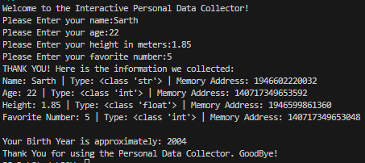

# Interactive Personal Data Collector

This project is a beginner-friendly Python application that collects personal information from users and demonstrates fundamental Python concepts such as variables, data types, type casting, input/output functions, arithmetic operations, and built-in functions.

## Features
- User input using `input()`
- Data type conversion using `int()` and `float()`
- Display variable data types using `type()`
- Display memory addresses using `id()`
- Birth year calculation
- Formatted output using f-strings

# Program Workflow
 - Display welcome message
 - Ask the user to enter personal details
 - Store the values in variables
 - Print each value with:
 - Data type
 - Memory address
 - Calculate birth year using the formula:
 - birth_year = 2026 - age
 - Display a goodbye message

## Screenshot

## Author
Sarth Thakar
